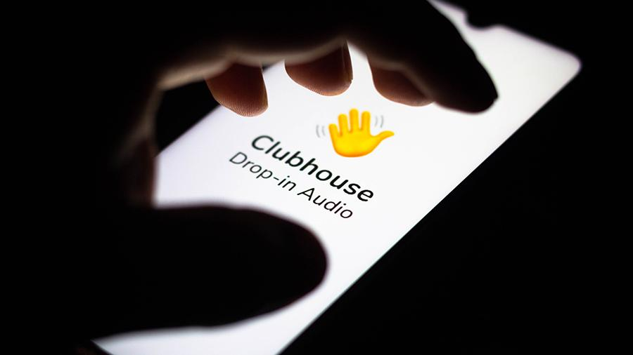

	
	 

# Curated list of awesome clubhouse resources 
A list of useful tools (apis, links, services etc.) for clubhouse users

## Contents

- [Create short link](#create-short-link-for-clubhouse-event)
- [Find rooms and events](#find-rooms-and-events)
- [Profile and rooms statistics](#profile-and-rooms-statistics)
- [Avatars and profile editors](#avatars-and-profile-editors)
- [Clubhouse APIs and open source libs](#clubhouse-apis-and-open-source-libs)
- [Related](#related)

## Create short link for clubhouse event

- [clublink.to](https://clublink.to/) - Optimize your Clubhouse links
- [clubhype.io](https://clubhype.io/) - Clubhype: Social media previews and landing pages for your Clubhouse events
- [gethostnotes.com](https://gethostnotes.com/) - Host Notes: Clubhouse events - better!
- [lu.ma/clubhouse](https://lu.ma/clubhouse) - Luma for Clubhouse

## Find rooms and events 

- [clubho.us](https://clubho.us/) - 👋 Clubhouse events and rooms catalog
- [roomsofclubhouse.com](https://roomsofclubhouse.com/) - Search all open rooms in the Clubhouse App

## Profile and rooms statistics

- [chblade.com](https://chblade.com/) - 👋 Clubhouse Profile Statistics

## Avatars and profile editors

- [avatar.lvwzhen.com](https://avatar.lvwzhen.com/) - Clubhouse Avatar Maker
- [clubhouseglow.com](https://www.clubhouseglow.com/) - Get a Clubhouse Glow avatar - Color circle your profile photo and be noticed right away
- [chpic.me](https://chpic.me/) - Clubhouse Profile Picture Ring

## Clubhouse APIs and open source libs 
- [APIs-guru/openapi-directory](https://github.com/APIs-guru/openapi-directory/tree/master/APIs/clubhouseapi.com/1) - Clubhouse open api
- [Seia-Soto/Clubhouse-API](https://github.com/Seia-Soto/clubhouse-api) - The API wrapper for Clubhouse application (drop-in audio chat) based on online private API documentation and pwned soruces by myself.
- [tonybruess/clubhouse-web](https://github.com/tonybruess/clubhouse-web) - This is an incomplete attempt at making a clubhouse web client.

## Related

- [Clubhouse products at Producthunt](https://www.producthunt.com/search?q=clubhouse&postedDate=90%3Adays) -  Awesome clubhouse related products on ProductHunt 😽

## Contributing

Contributions are very welcome!

You may create pull request on GitHub 🤖 

Or simply send link to my twitter ( https://twitter.com/tkachenko ) or email andrey@tkachenko.xyz 
